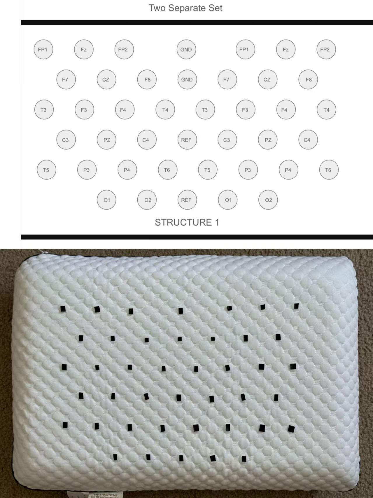

# UPillow: EEG-Based Smart Pillow for Sleep Staging and Seizure Detection

This project designed and prototyped a smart pillow system embedded with EEG sensors and a low-power chip for unobtrusive sleep monitoring, enabling long-term brainwave recording.
Also, it implements a complete pipeline for **EEG signal preprocessing, sleep stage classification, and epileptic seizure detection**, designed for integration into a **smart pillow**. The system leverages **public benchmark datasets (Sleep-EDF Expanded, CHB-MIT)** for model development and evaluation, supports **synthetic seizure simulation**, and enables **real-time inference on OpenBCI 16-channel signals** with robust noise cleaning.

---

## Prototype Design & Implementation

To achieve **long-term, comfortable, and unobtrusive EEG monitoring**, I designed and built an initial prototype device. Unlike traditional head-mounted EEG systems, this prototype distributes the electrode array across the **surface of a pillow**, allowing users to collect EEG signals naturally during sleep. The goal is to transform EEG monitoring into an **everyday device**, maintaining data quality without sacrificing comfort.

### Electrode Distribution Concept

**Figure 1. Standard EEG electrode distribution on a cap device.**

Figure 1 shows the standard electrode distribution on a traditional cap-style EEG device. While widely used in research and clinical settings, such systems are uncomfortable, restrict sleeping positions, and are impractical for long-term monitoring. My design reimagines the electrode layout by embedding them into the pillow surface, maintaining contact with the scalp while ensuring natural, comfortable sleep. This enables **passive, unobtrusive EEG acquisition** and brings EEG closer to daily life.

### Dual-System Verification Layout

**Figure 2. Selected dual EEG + chip layout design.**


**Figure 3. Alternative dual-system layout option 1.**


**Figure 4. Alternative dual-system layout option 2.**

Figures 2, 3, and 4 illustrate three layout options for the prototype, each using a **dual EEG + chip setup**. This dual-system design enables cross-verification of signals, reducing risks from single-point failures and noise interference. After comparison and preliminary testing, the configuration shown in Figure 2 was selected as the final design due to its balance of compactness, signal coverage, and hardware feasibility.

### Prototype Comparison

**Figure 5. Comparison of design sketch and physical prototype.**

Figure 5 compares the design sketch with the physical prototype. The prototype faithfully implements the core concepts: multi-channel electrodes, acquisition chips, and integration into the pillow body. While still an early-stage build, it already supports basic data collection and validation.

### Installed Device

**Figure 6. Installed prototype with electrodes embedded in pillow.**

Figure 6 shows the installed prototype. The electrode array is embedded inside the pillow, while the exterior still looks and feels like a normal pillow. Users can sleep on it without noticing the embedded hardware, ensuring a natural testing environment.

### Human Testing

**Figure 7. Human testing with Apple Watch cross-validation.**

Figure 7 shows myself lying on the pillow during initial testing. In this phase, I also wore an Apple Watch to record heart rate and sleep stages as a simple cross-validation reference. These early tests confirmed the prototype’s feasibility and stability in real use, providing valuable data for algorithm optimization and long-term experiments.

---

Through this prototype’s concept and realization, UPillow aims to go beyond being just a research device, evolving into a **daily-use smart health product**. By combining the clinical value of EEG with everyday sleep monitoring, it provides a novel solution for **sleep health management and early seizure detection**.


---

## Pipeline Overview

```text
        +------------------+
        | Public Datasets  |   Sleep-EDF (sleep staging)
        | (Sleep-EDF,      |   CHB-MIT (seizure detection)
        |  CHB-MIT)        |
        +------------------+
                 |
                 v
       ----------------------
       | Training Pipeline |
       ----------------------
       Preprocessing: filtering, resampling, windowing
       Feature-based models (RandomForest)
       Deep models (1D-CNN, Multi-channel CNN)
                 |
                 v
        +-------------------+
        | Trained Models    |
        |  (PyTorch/Sklearn)|
        +-------------------+
                 |
                 v
       -----------------------
       | OpenBCI Integration |
       -----------------------
       Signal acquisition from OpenBCI
       Cleaning: bad value repair, band-pass, notch, CAR, z-score
       Windowing (30s for sleep, 2s for seizures)
       Real-time streaming via Serial/BLE
                 |
                 v
       -----------------------
       | Inference Results   |
       -----------------------
       Sleep stage predictions (W/N1/N2/N3/REM)
       Seizure detection (probability, voting, alerts)
```

---

## Features

* **Data Preprocessing**
  * Band-pass filter (0.5–40 Hz) and powerline notch (50/60 Hz, default 60 Hz)
  * Bad value/saturation repair (e.g., OpenBCI-specific values like `-187500.0223`) via linear interpolation
  * Common Average Reference (CAR) for multi-channel signals
  * Channel-wise z-scoring per recording
  * Windowing: 30s epochs for sleep staging, 2s for seizure detection

* **Modeling**
  * Sleep staging: RandomForest with handcrafted spectral features (delta, theta, alpha, sigma, beta), 1D-CNN, and Multi-channel CNN (`TinySleepCNNMulti`, input shape `B×C×T`)
  * Seizure detection: CNN trained on CHB-MIT, synthetic seizure simulation (3 Hz spike-and-wave bursts), and rule-based detection (short-time energy + 3–4 Hz spectral ratio)

* **Datasets**
  * **Sleep-EDF Expanded**: Polysomnography with hypnograms, single-channel (e.g., Fpz-Cz) or multi-channel EEG
  * **CHB-MIT**: Pediatric epilepsy dataset with seizure annotations
  * **Synthetic Seizures**: Simulated spike-and-wave bursts injected into clean EEG

* **Real-Time Inference**
  * Supports OpenBCI 16-channel `.txt` (GUI RAW) and `.csv` (BrainFlow) formats
  * Serial and BLE streaming with sliding window inference (default: 2s windows, majority voting over 5 windows)
  * Configurable via `config.yaml` (e.g., sampling rate, channel selection, voting parameters)

---

## Requirements

* Python ≥ 3.9
* Key dependencies: `mne`, `numpy`, `scipy`, `pandas`, `scikit-learn`, `torch`, `wfdb`, `tqdm`
* Install dependencies:
  ```bash
  pip install -r requirements.txt
  ```
* Recommended: GPU for PyTorch training (optional for inference)
* Optional: `pyserial` for Serial streaming, BLE client for Bluetooth streaming

---

## Dataset Setup

You can download all required public datasets automatically:

```bash
# Fetch Sleep Cassette, Sleep Telemetry, and CHB-MIT into the paths defined in config.yaml
bash scripts/00_download_datasets.sh

# Download a specific subset only (examples)
python -m src.data.download_datasets --sleep-cassette
python -m src.data.download_datasets --sleep-telemetry
python -m src.data.download_datasets --chb-mit
```

The script uses the `sleep_edf.raw_dir` and `chb_mit.raw_dir` entries from `config.yaml` and keeps the official folder
hierarchy provided by PhysioNet. Sleep-EDF subsets are pulled through the MNE-Python dataset fetchers (no missing WFDB
headers required), while CHB-MIT continues to rely on the WFDB utilities. Manual download is still supported:

1. **Sleep-EDF Expanded**
   * Download from [PhysioNet](https://physionet.org/content/sleep-edfx/1.0.0/) (requires free PhysioNet account)
   * Place EDF and hypnogram files in `data/sleep-edf/`

2. **CHB-MIT**
   * Download from [PhysioNet](https://physionet.org/content/chbmit/1.0.0/) (requires free PhysioNet account)
   * Place EDF files and `chbXX-summary.txt` in `data/chb-mit/`

3. **OpenBCI Signals**
   * Place `.txt` (OpenBCI GUI RAW) or `.csv` (BrainFlow) files in the project root or `data/openbci/`

---

## Syncing Changes with GitHub

The repository includes a helper for pushing local commits to GitHub and
fast-forwarding the current branch with the latest remote changes. It assumes you
have configured a remote (for example `origin`) and that your Git credential
helper can authenticate with GitHub (SSH keys or HTTPS token).

```bash
# Push the current branch to origin (use --set-upstream the first time)
bash scripts/99_git_sync.sh push --set-upstream

# Pull the latest commits from origin for the current branch
bash scripts/99_git_sync.sh pull

# Target a specific branch/remote if needed
bash scripts/99_git_sync.sh push --remote origin --branch main
bash scripts/99_git_sync.sh pull --remote upstream --branch develop
```

Behind the scenes the helper runs `git push` and `git pull --ff-only`, surfacing
errors such as authentication failures or non-fast-forward situations with clear
messages. You can still use standard Git commands directly; the helper simply
provides a consistent interface alongside the other project scripts.

---

## Running the Pipeline

### 1. Preprocess Data
Preprocess datasets with configurable parameters in `config.yaml` (e.g., sampling rate: 100 Hz for Sleep-EDF, 200 Hz for CHB-MIT; channel selection).
```bash
# Sleep-EDF (30s windows, single or multi-channel)
bash scripts/01_prepare_sleepedf.sh
# CHB-MIT (2s windows for seizures)
bash scripts/05_prepare_chbmit.sh
# Multi-channel Sleep-EDF
bash scripts/12_prepare_sleepedf_multi.sh
# Multi-channel CHB-MIT
bash scripts/13_prepare_chbmit_multi.sh
```

### 2. Train Models
Training uses subject-wise splits to avoid data leakage, with metrics including accuracy, macro-F1, and Cohen’s kappa.
```bash
# RandomForest for sleep staging (leave-one-subject-out CV)
bash scripts/02_train_sleep_rf.sh
# Multi-channel RandomForest for sleep staging
bash scripts/09_train_sleep_rf_multi.sh
# 1D-CNN for sleep staging (single-channel)
bash scripts/03_train_sleep_cnn.sh
# Multi-channel CNN for sleep staging
bash scripts/07_train_sleep_cnn_multi.sh
# Multi-channel CNN for seizure detection (CHB-MIT)
bash scripts/08_train_chbmit_cnn_multi.sh
```

### 3. Evaluate Models
Evaluate sleep staging models with confusion matrices and detailed metrics.
```bash
bash scripts/04_eval_sleep.sh
bash scripts/14_eval_sleep_multi.sh
```

### 4. Synthetic Seizure Simulation
Simulate 3 Hz spike-and-wave bursts for controlled testing or use rule-based detection.
```bash
# Generate synthetic seizures
bash scripts/10_simulate_seizures.sh
# Rule-based detection (energy + 3–4 Hz spectral ratio)
bash scripts/11_detect_rulebased.sh
```

### 5. Offline Inference with OpenBCI Data
Inference scripts automatically clean and resample data to match training conditions.
```bash
# Sleep staging (30s@100 Hz, multi-channel CNN)
bash scripts/30_infer_sleep_openbci.sh
# Example with custom parameters:
python -m src.sleep.infer_sleep_openbci --input <your_openbci_file> --ckpt models/ckpts/sleep_cnn_multi_best.pt --fs 100 --epoch 30

# Seizure detection (2s@200 Hz, multi-channel CNN, majority voting)
bash scripts/31_infer_seizure_openbci.sh
# Example with custom parameters:
python -m src.seizure.infer_seizure_openbci --input <your_openbci_file> --ckpt models/ckpts/chbmit_cnn_multi_best.pt --fs 200 --win 2 --hop 0.5 --vote_k 5 --thr 0.5
```

### 6. Real-Time Streaming
Stream data via Serial or BLE with a ring buffer and majority voting for smoothed predictions.
```bash
# Serial (e.g., COM4 at 115200 baud, CSV format: C values per row)
bash scripts/20_stream_infer_serial.sh
# BLE (requires device address and characteristic UUID, float32 array)
bash scripts/21_stream_infer_ble.sh
```
Configure streaming parameters (e.g., `--channels`, `--window_len`, `--vote_k`) in `config.yaml` or via command-line arguments.

---

## Expected Results

* **Sleep Staging**: CNN achieves ~83–88% accuracy on Sleep-EDF (single-channel), with ~87% possible using multi-channel CNN and extended training. RandomForest is faster but slightly less accurate.
* **Synthetic Seizure Detection**: Achieves ~90% sensitivity with <10% false positives per hour by tuning thresholds and majority voting.
* **Real Seizures (CHB-MIT)**: F1-scores vary across patients but demonstrate reliable early detection with multi-channel CNN.

---

## Project Scope

This repository provides:
* An end-to-end EEG processing and machine learning pipeline for sleep and seizure monitoring.
* Training on public datasets (Sleep-EDF, CHB-MIT) for generalizable, reproducible models.
* Seamless integration with OpenBCI hardware for real-time inference via Serial or BLE.
* A proof-of-concept for a **smart pillow** that unobtrusively monitors sleep stages (W, N1, N2, N3, REM) and detects epileptic seizures early.

---

## Tips for Best Results
* Normalize data per recording (z-score) before modeling.
* Map R&K stages “3” and “4” to N3 (AASM standard).
* Use subject-wise splits to prevent data leakage.
* Start with RandomForest for quick validation, then switch to CNN for higher accuracy.
* Adjust preprocessing and inference parameters in `config.yaml` (e.g., sampling rate, filter bands, channel priority).

---

## Citations
* Sleep-EDF Expanded: [PhysioNet](https://physionet.org/content/sleep-edfx/1.0.0/)
* CHB-MIT Scalp EEG Database: [PhysioNet](https://physionet.org/content/chbmit/1.0.0/)
* AASM stage mapping: American Academy of Sleep Medicine guidelines
* MNE documentation: [MNE-Python](https://mne.tools/stable/index.html) for EDF file handling